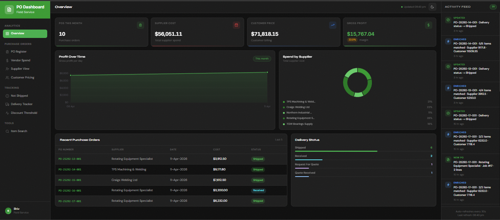

<h1 align="center">PO Dashboard</h1>

<p align="center">
  Premium SaaS dashboard for visualizing Purchase Order analytics, supplier spend, delivery tracking, and discount thresholds for field service businesses.
</p>

<p align="center">
  
</p>

---

## 🚀 Live Demo
**Production URL:**  
https://po-dashboard-two.vercel.app/

---

## 📖 Overview
PO Dashboard is the frontend visualization layer for the existing PO Parser pipeline. It consumes Google Sheets data generated from incoming Purchase Order PDFs and transforms it into actionable business analytics through a premium dashboard UI.

---

## ✨ Features
- Secure Authentication Login Interface
- KPI Overview Cards  
- Profit & Spend Analytics Charts  
- Purchase Order Register  
- Vendor Spend Tracking  
- Supplier Delivery Monitoring  
- Discount Threshold Management  
- Real-Time Polling Refresh  

---

## 🛠 Tech Stack
- **Frontend:** HTML, TailwindCSS, Vanilla JavaScript, Chart.js  
- **Backend:** Vercel Serverless Functions  
- **Data Source:** Google Sheets API  
- **Deployment:** Vercel  

---

## 📂 Project Structure
```plaintext
/api            Backend API routes
/Assets         UI preview images / static assets
/checkpoints    Project milestone snapshots
/docs           Internal project documentation and specifications
/scripts        Utility scripts for local development and automation
```

---

## 🔐 Environment Variables
```env
SPREADSHEET_ID=
GOOGLE_CREDENTIALS=
```

---

## 💻 Local Development
```bash
npm install
node scripts/serve.mjs
```

---

## 🚢 Deployment
Deployed via Vercel with environment variables configured in the Vercel dashboard.

---

## 📌 Status
Currently in active development and production refinement.